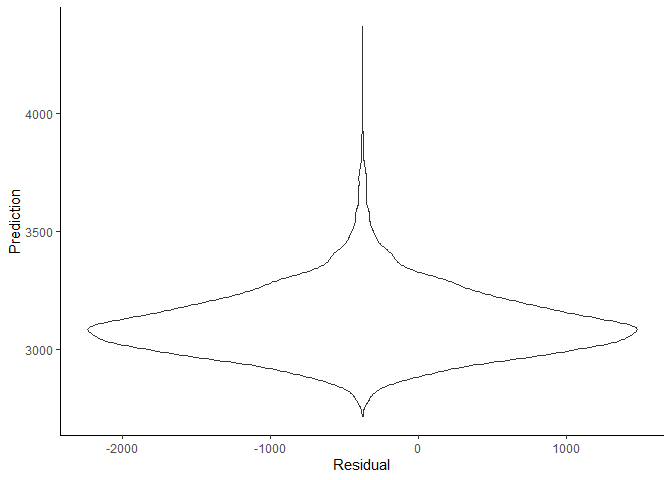
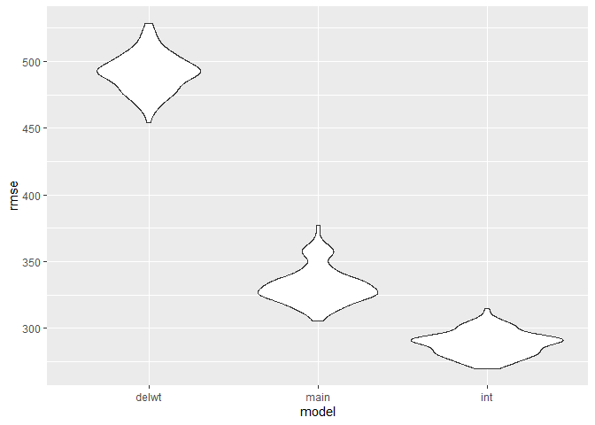
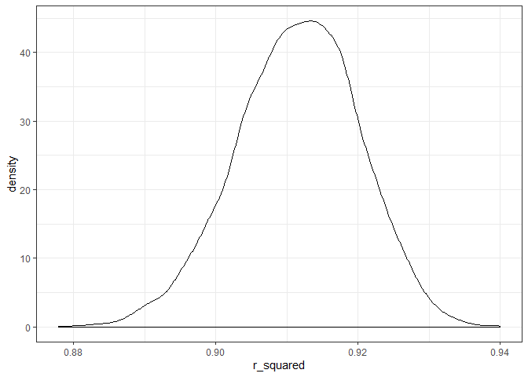
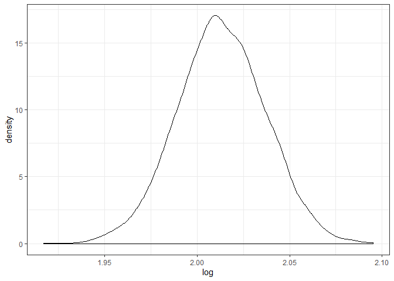

p8105\_hw6\_NL2655
================
Nankun
2019/11/25

# Problem 1

## Data cleaning

``` r
birthweight =
  read_csv("birthweight.csv") %>% 
  janitor::clean_names() %>% 
  drop_na() %>% 
  mutate(
    babysex = as_factor(babysex),
    frace = as_factor(frace),
    malform = as_factor(malform),
    mrace = as_factor(mrace)
  )
```

    ## Parsed with column specification:
    ## cols(
    ##   .default = col_double()
    ## )

    ## See spec(...) for full column specifications.

    ## Warning in FUN(X[[i]], ...): strings not representable in native encoding
    ## will be translated to UTF-8

## Building model

``` r
lm_delwt = lm(bwt ~ delwt, data = birthweight)
lm_delwt %>% 
  broom::tidy() %>% 
   knitr::kable(digits = 3)
```

| term        | estimate | std.error | statistic | p.value |
| :---------- | -------: | --------: | --------: | ------: |
| (Intercept) | 2147.912 |    49.367 |    43.509 |       0 |
| delwt       |    6.639 |     0.335 |    19.804 |       0 |

``` r
  birthweight %>%  
  add_residuals(lm_delwt) %>% 
  add_predictions(lm_delwt) %>% 
  ggplot(aes(x = resid, y = pred)) +
  geom_violin() +
  labs(
    x = "Residual",
    y = "Prediction"
  ) +
  theme_classic()
```

<!-- -->

*Description*

## Compare models

``` r
set.seed(1)

#model check#
lm_main = lm(bwt ~ blength + gaweeks, data = birthweight)
lm_int = lm(bwt ~ bhead * blength * babysex, data = birthweight)


cv_df = 
  crossv_mc(birthweight, 100) %>% 
  mutate(
    train = map(train, as_tibble),
    test = map(test, as_tibble)
    ) %>% 
    mutate(lm_delwt = map(train, ~lm(bwt ~ delwt, data = .x)),
           lm_main  = map(train, ~lm(bwt ~ blength + gaweeks, data = .x)),
           lm_int   = map(train, ~lm(bwt ~ bhead * blength * babysex, data = .x))
           ) %>% 
  mutate(rmse_delwt = map2_dbl(lm_delwt, test, ~rmse(model = .x, data = .y)),
         rmse_main  = map2_dbl(lm_main, test, ~rmse(model = .x, data = .y)),
         rmse_int   = map2_dbl(lm_int, test, ~rmse(model = .x, data = .y)))
cv_df %>% 
  select(starts_with("rmse")) %>% 
  pivot_longer(
    everything(),
    names_to = "model", 
    values_to = "rmse",
    names_prefix = "rmse_") %>% 
  mutate(model = fct_inorder(model)) %>% 
  ggplot(aes(x = model, y = rmse)) + geom_violin()
```

<!-- -->

# Problem 2

## data cleaning

``` r
set.seed(1551)

weather_df = 
  rnoaa::meteo_pull_monitors(
    c("USW00094728"),
    var = c("PRCP", "TMIN", "TMAX"), 
    date_min = "2017-01-01",
    date_max = "2017-12-31") %>%
  mutate(
    name = recode(id, USW00094728 = "CentralPark_NY"),
    tmin = tmin / 10,
    tmax = tmax / 10) %>%
  select(name, id, everything())
```

    ## Registered S3 method overwritten by 'crul':
    ##   method                 from
    ##   as.character.form_file httr

    ## Registered S3 method overwritten by 'hoardr':
    ##   method           from
    ##   print.cache_info httr

    ## file path:          C:\Users\freew\AppData\Local\rnoaa\rnoaa\Cache/ghcnd/USW00094728.dly

    ## file last updated:  2019-11-25 06:32:28

    ## file min/max dates: 1869-01-01 / 2019-11-30

``` r
rsq=
  weather_df %>% 
  modelr::bootstrap(n = 5000) %>% 
  mutate(
    models = map(strap, ~lm(tmax ~ tmin, data = .x) ),
    results = map(models, broom::glance)) %>% 
  select(-strap, -models) %>% 
  unnest(results) %>%
  janitor::clean_names() %>%
  select(id, r_squared)

rsq %>% 
  ggplot(aes(x = r_squared)) + 
  geom_density() + 
  theme_bw()
```

<!-- -->

``` r
logtime=
  weather_df %>% 
  modelr::bootstrap(n = 5000) %>% 
  mutate(
    models = map(strap, ~lm(tmax ~ tmin, data = .x) ),
    results = map(models, broom::tidy)) %>% 
  select(-strap, -models) %>% 
  unnest(results) %>%
  janitor::clean_names() %>% 
  select(id, term, estimate) %>% 
  pivot_wider(
    names_from = term,
    values_from = estimate
  ) %>% 
  rename(
    beta_0 = "(Intercept)",
    beta_1 = "tmin"
    ) %>% 
  mutate( log = log( beta_0 * beta_1, base = exp(1)))

logtime %>% 
  ggplot(aes(x = log)) + 
  geom_density() + 
  theme_bw()
```

<!-- -->

\#Description\# by ploting simple linear regression with tmax as the
response and tmin as predictor, we can see that the distribution of both
log(beta0\*beta1) and r\_squre can be assumed as normally distributed.
and the 2.5% and 97.5% quantiles of log estimation is 1.966, 2.059 and
the 2.5% and 97.5% quantiles of r\_square is 0.894, 0.927. the quantiles
are provided for the confidence interval.
